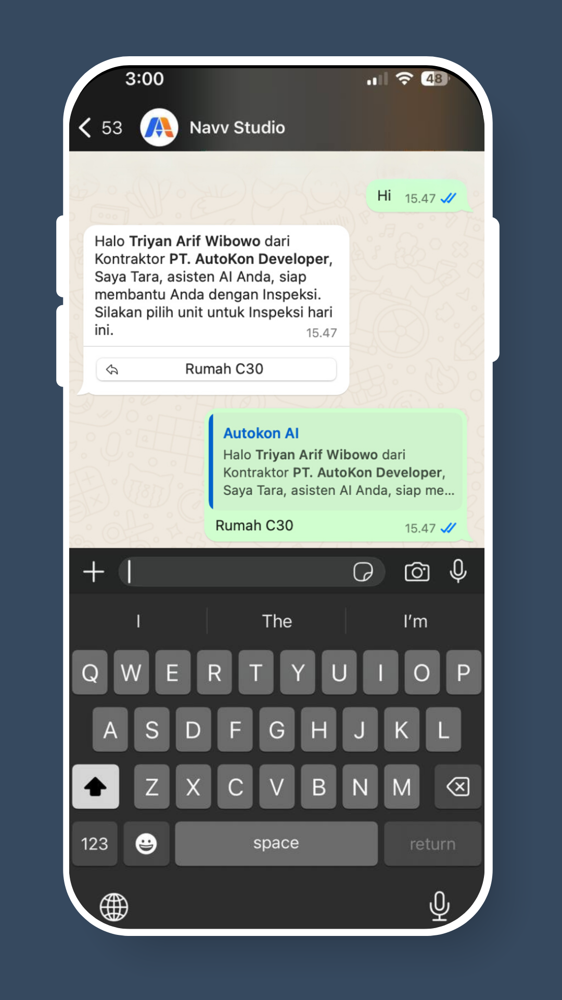
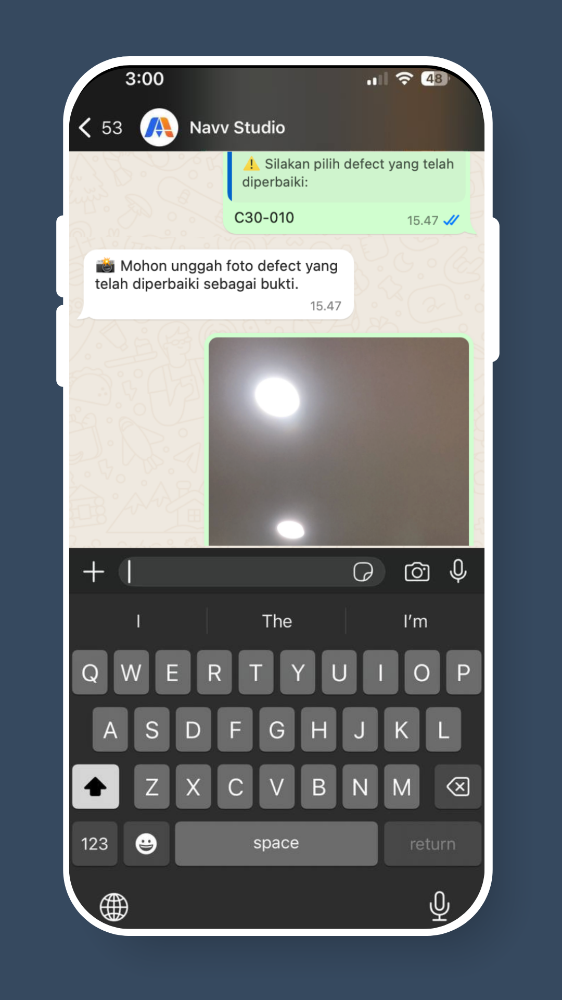

# How To Log Defect Rectifications via WhatsApp

## Step 0: Print Inspection Report for Reference

Login to AutoKon WebApp and navigate to the **Defect Management > Overview** menu from the sidebar.

Select the relevant **unit(s)** and click **“Export to PDF”** to download and print the inspection report for reference during defect rectification.


Print out the inspection report beforehand to easily match each defect with its Defect ID.\
This also helps you accurately identify the defects that require rectification on-site.


<figure><figcaption></figcaption></figure>

## Step 1: Open & Activate Bot

Open your WhatsApp chat with AutoKon and send **“Hi”** to activate the bot.

<figure><figcaption></figcaption></figure>

## Step 2: Select Unit

Choose the **Unit ID** where you want to log the defect rectification.

<figure><figcaption></figcaption></figure>

## Step 3: Select Defect ID&#x20;

Choose the D**efect ID** where you want to log the defect rectification.


Tip: Print out the inspection report beforehand to easily match each defect with its Defect ID.\
This also helps you accurately identify the defects that require rectification on-site.


<figure><figcaption></figcaption></figure>

## Step 4: Capture Defect Rectification

Take a clear **photo of the defect rectification** and send it in the chat.

<figure><figcaption></figcaption></figure>

## Last Step: Continue or End Session

Choose to **log another defect**, **change unit**, or **end the session**.

<figure><figcaption></figcaption></figure>

✅ **That’s it**! The defect rectification is successfully recorded and will appear on your dashboard in real-time. Your real estate developer will also be informed of your submission.
