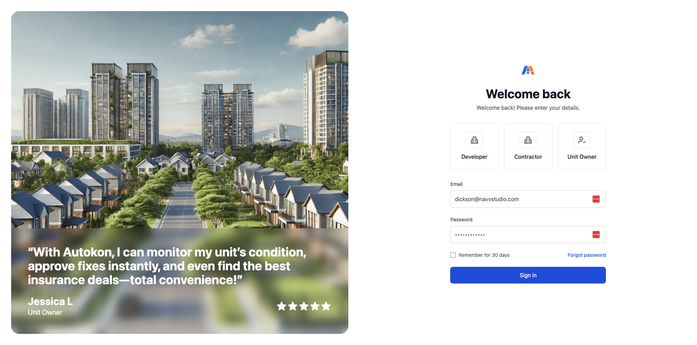

# How To Login

## Step 1: Go to the AutoKon Website

You can use Google Chrome, Microsoft Edge, Safari, or any browser you are familiar with.

Type in the website address provided to you into the address bar at the top of your browser, then press **Enter**.

Website: [https://app.autokon.id/](https://app.autokon.id/)


Tip: Bookmark the page for easy access next time!


## Step 2: Enter Your Login Details

<figure><figcaption>
Desktop View
</figcaption></figure>

You will see the login page with two fields:

* **Email:** Type the email address registered with AutoKon.
* **Password:** Type your password carefully. It is case-sensitive.

## Final Step: Click the “**Sign In”** Button

After entering your details, click on the **Sign In** button.

<figure><figcaption>
Desktop View
</figcaption></figure>

✅ **You’re in!** You should now see your dashboard.

