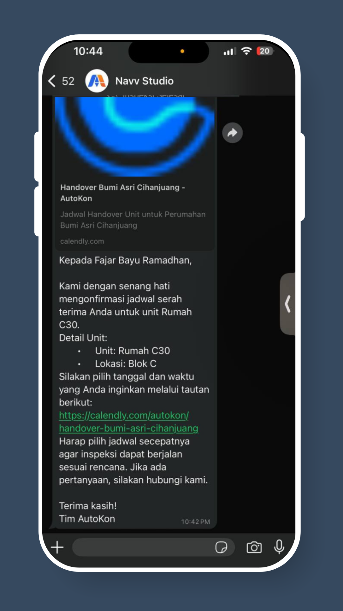
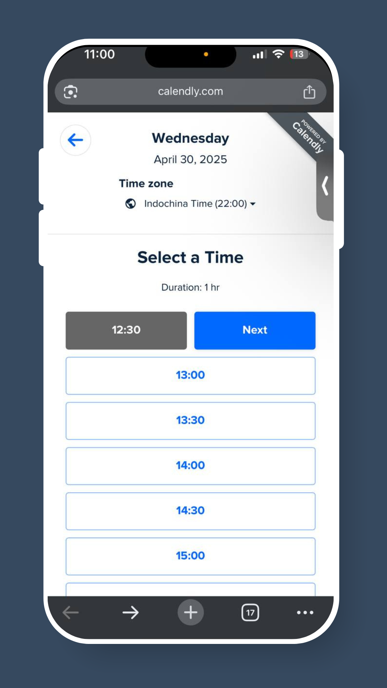
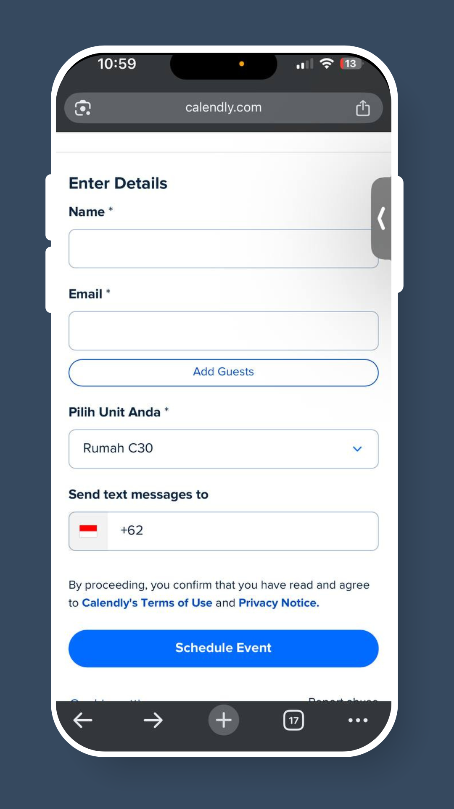
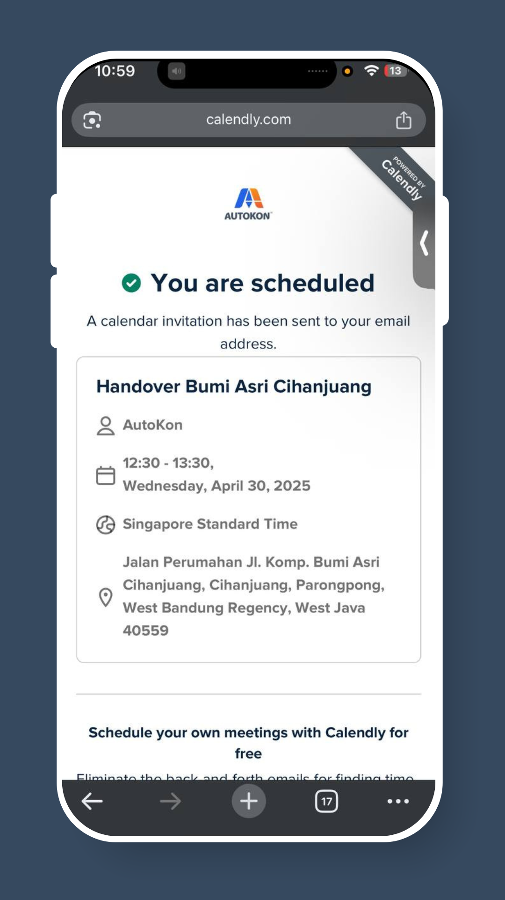

# How to Schedule For Unit Inspection

## Step 1: **Check WhatsApp Message**

Look for a message from your Real Estate Developer with a **booking link.**

<figure><figcaption></figcaption></figure>

## Step 2: Tap the Link

This opens a **booking page** to schedule your inspection.

<figure><figcaption></figcaption></figure>

## Step 3: Pick a Date and Time Slot

Select your **preferred date and time** from the available options.

<figure><figcaption></figcaption></figure>

## Step 4: Enter Your Details

Fill in your **name, email, and unit number** (if asked).

<figure><figcaption></figcaption></figure>

## Final Step: Confirm Your Booking

Tap **“Schedule Event”**. You’ll receive a **confirmation message** right away.

<figure><figcaption></figcaption></figure>

✅ **Your Unit Inspection is scheduled!** Your real estate developer will be notified and will prepare for your inspection.
