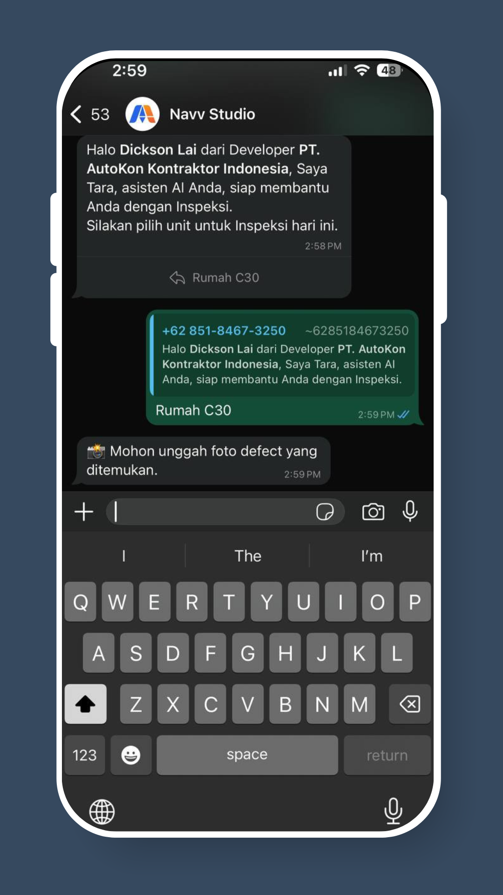
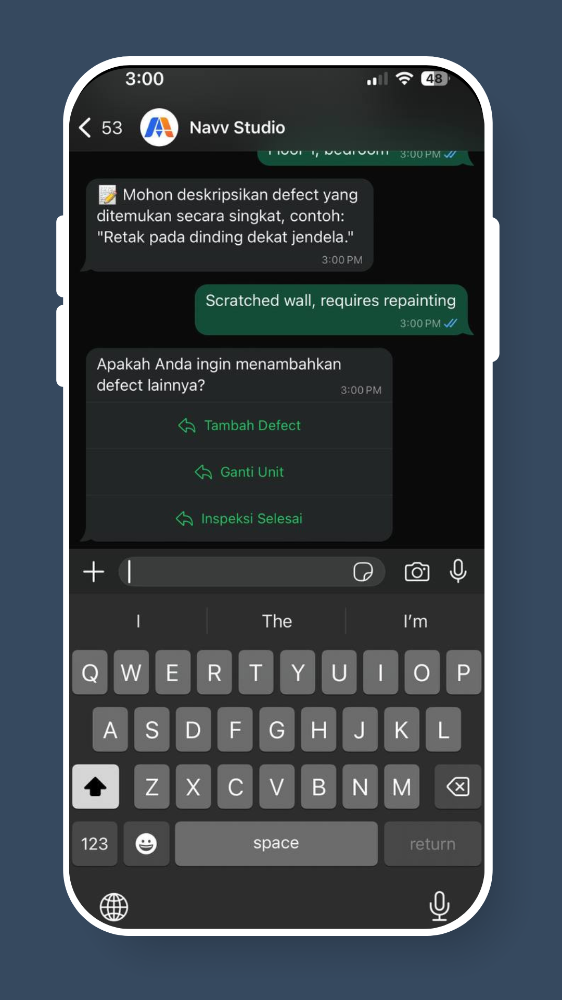

# How To Log Defects via WhatsApp

## Step 1: Open & Activate Bot

Open your WhatsApp chat with AutoKon and send **“Hi”** to activate the bot.

<figure><figcaption></figcaption></figure>

## Step 2: Select Unit For Defect Logging

Choose the **unit number** where you want to log the defect.

<figure><figcaption></figcaption></figure>

## Step 3: Capture Defect

Take a clear **photo of the defect** and send it in the chat.

<figure><figcaption></figcaption></figure>

## Step 4: Provide Details of Defect

Enter the **location** and a **short description** of the defect.

<figure><figcaption></figcaption></figure>

## Last Step: Continue or End Session

Choose to **log another defect**, **change unit**, or **end the session**.

<figure><figcaption></figcaption></figure>

✅ **That’s it**! The defect is successfully recorded and will appear on your dashboard in real-time.
