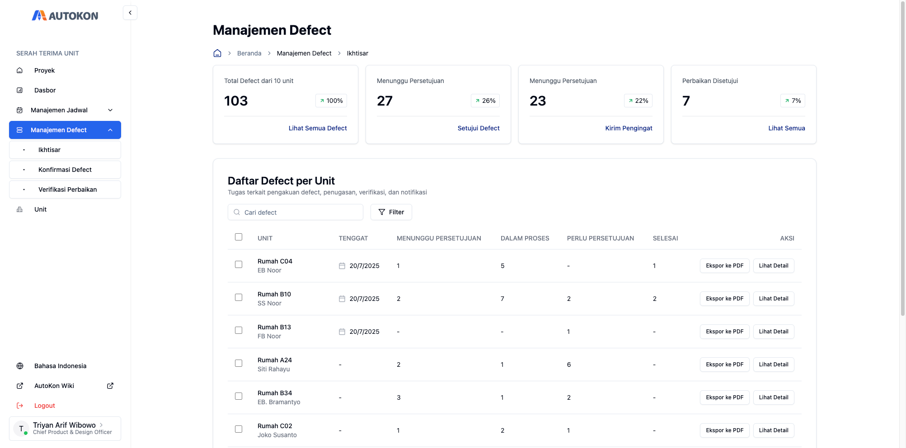

# Bagaimana Cara Login

## Langkah 1: Buka Situs Web AutoKon

Anda dapat menggunakan Google Chrome, Microsoft Edge, Safari, atau browser apa pun yang Anda kenal.

Ketikkan alamat situs web yang diberikan kepada Anda di bilah alamat di bagian atas browser Anda, kemudian tekan **Enter**.

Situs Web: [https://app.autokon.id/](https://app.autokon.id/)


Tip: Bookmark halaman ini untuk akses mudah di lain waktu!


## Langkah 2: Masukkan Detail Login Anda

<figure><figcaption>
Tampilan Desktop
</figcaption></figure>

Anda akan melihat halaman login dengan dua bidang:

* **Email:** Ketik alamat email yang terdaftar di AutoKon.
* **Kata Sandi:** Ketik kata sandi Anda dengan hati-hati. Ini peka terhadap huruf besar dan kecil.

## Langkah Terakhir: Klik Tombol “**Masuk**”

Setelah memasukkan detail Anda, klik tombol **Masuk**.

<figure><figcaption>
Tampilan Desktop
</figcaption></figure>

✅ **Anda sudah masuk!** Anda sekarang harus melihat dashboard Anda.