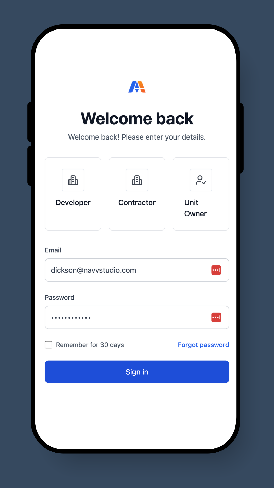
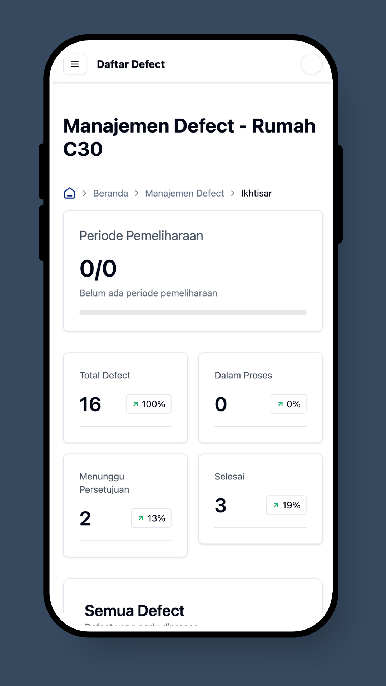

# Cara Login

## Langkah 1: Buka Website AutoKon

Anda dapat menggunakan Google Chrome, Microsoft Edge, Safari, atau browser apa pun yang Anda kenal.

Ketikkan alamat situs web yang diberikan kepada Anda di bilah alamat di bagian atas browser Anda, lalu tekan **Enter**.

Website: [https://app.autokon.id/](https://app.autokon.id/)


&#x20;Tip: Tandai halaman ini untuk akses mudah berikutnya!


## Langkah 2: Masukkan Detail Login Anda

<figure><figcaption></figcaption></figure>

Anda akan melihat halaman login dengan dua bidang:

* **Email:** Ketikkan alamat email yang terdaftar di AutoKon.
* **Password:** Ketikkan password Anda dengan hati-hati. Ini peka terhadap huruf besar dan kecil.

## Langkah Terakhir: Klik Tombol “**Sign In**”

Setelah memasukkan detail Anda, klik tombol **Sign In**.

<figure><figcaption></figcaption></figure>

✅ **Anda masuk!** Anda sekarang harus bisa melihat dashboard Anda.