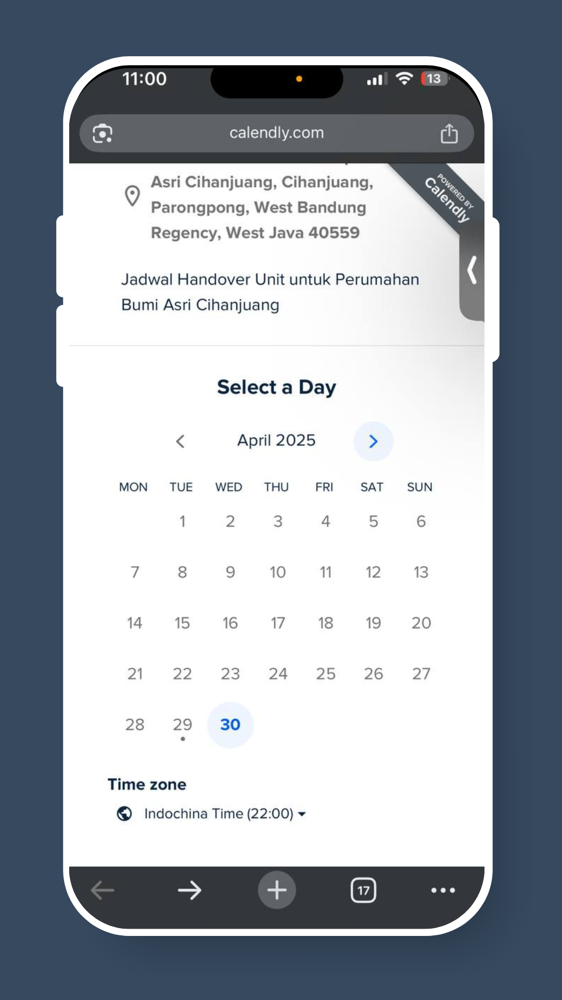

# Cara Menjadwalkan Inspeksi Unit

## Langkah 1: **Periksa Pesan WhatsApp**

Cari pesan dari Pengembang Real Estat Anda dengan **tautan pemesanan.**

<figure><figcaption></figcaption></figure>

## Langkah 2: Ketuk Tautan

Ini akan membuka **halaman pemesanan** untuk menjadwalkan inspeksi Anda.

<figure><figcaption></figcaption></figure>

## Langkah 3: Pilih Tanggal dan Slot Waktu

Pilih **tanggal dan waktu yang Anda inginkan** dari opsi yang tersedia.

<figure><figcaption></figcaption></figure>

## Langkah 4: Masukkan Detail Anda

Isi **nama, email, dan nomor unit** Anda (jika diminta).

<figure><figcaption></figcaption></figure>

## Langkah Terakhir: Konfirmasi Pemesanan Anda

Ketuk **"Jadwalkan Acara"**. Anda akan menerima **pesan konfirmasi** segera.

<figure><figcaption></figcaption></figure>

✅ **Inspeksi Unit Anda telah dijadwalkan!** Pengembang real estat Anda akan diberitahu dan akan mempersiapkan inspeksi Anda.