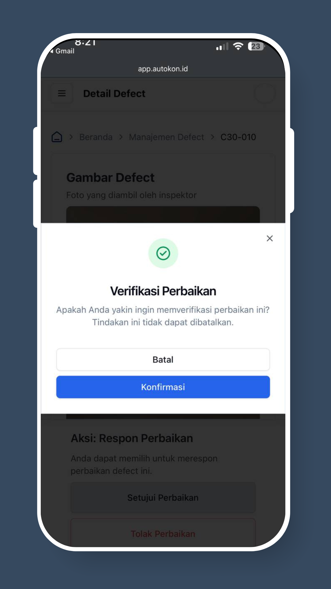

# Cara Menyetujui/Menolak Perbaikan Cacat

## Langkah 1: Periksa Notifikasi Email Anda

Anda akan menerima peringatan melalui email saat perbaikan cacat diajukan dan siap untuk ditinjau.

<figure><figcaption></figcaption></figure>

## Langkah 2: Ketuk Tautan

Klik tautan dalam email untuk mengakses detail cacat di situs web.

## Langkah 3: Log In (Jika Diperlukan)

Log in jika diminta. Untuk petunjuk, lihat [“Cara Login"](https://autokon.gitbook.io/autokon-wiki/customers/how-to-login).

## **Langkah 4:** Tinjau Detail Cacat

Lihat detail cacat untuk melihat **foto yang diajukan (sebelum & setelah perbaikan cacat)**, **deskripsi**, dan **timeline perbaikan**.

<figure><figcaption></figcaption></figure>

## **Langkah Terakhir:** Setujui atau Tolak

* Klik **"Setujui"** jika perbaikan dapat diterima.

<figure><figcaption></figcaption></figure>

* Klik **"Tolak"** jika diperlukan pekerjaan tambahan dan tulis komentar yang menjelaskan alasannya.

<figure><figcaption></figcaption></figure>

✅ Sekali diajukan, status akan diperbarui dan baik pengembang real estat dan kontraktor akan diberitahu tentang keputusan Anda.
