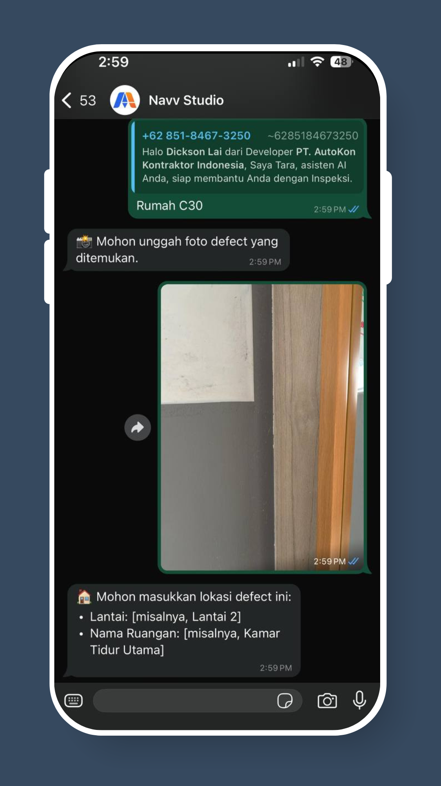
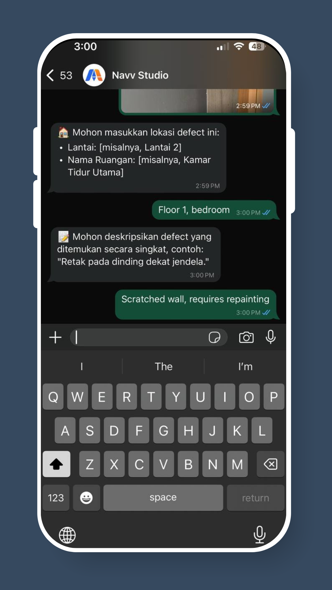

# Cara Melaporkan Cacat melalui WhatsApp

## Langkah 1: Buka & Aktifkan Bot

Buka percakapan WhatsApp Anda dengan AutoKon dan kirim **"Hi"** untuk mengaktifkan bot.

<figure><figcaption></figcaption></figure>

## Langkah 2: Pilih Unit Untuk Pelaporan Cacat

Pilih **nomor unit** tempat Anda ingin melaporkan cacat.

<figure><figcaption></figcaption></figure>

## Langkah 3: Tangkap Cacat

Ambil **foto cacat** yang jelas dan kirimkan dalam percakapan.

<figure><figcaption></figcaption></figure>

## Langkah 4: Berikan Detail Cacat

Masukkan **lokasi** dan **deskripsi singkat** dari cacat tersebut.

<figure><figcaption></figcaption></figure>

## Langkah Terakhir: Lanjutkan atau Akhiri Sesi

Pilih untuk **melaporkan cacat lain**, **mengganti unit**, atau **mengakhiri sesi**.

<figure><figcaption></figcaption></figure>

✅ **Itulah dia**! Cacat berhasil dicatat dan akan muncul di dasbor Anda secara real-time.